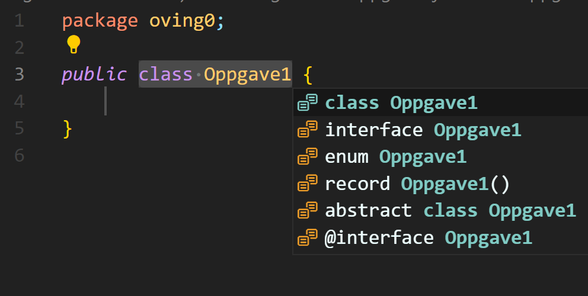

# Python VS Java

Noe av det første du kommer til å merke når du skal programmere i Java er at det kreves en del flere linjer kode enn i Python. La oss starte med noe av det enkleste, å skrive ut en tekst til konsollen.

## Skrive ut tekst til konsollen

I Python er det veldig greit å skrive ut tekst til konsollen. Du trenger bare å skrive `print("tekst")` og så vil teksten skrives ut til konsollen. I Java trengs det litt bokstaver:

**Python**:

```python
print("Hello World!")
```

**Java**:

```java
System.out.println("Hello World!");
```

En snarvei i VS Code for å slippe å skrive hele `System.out.println()` er å skrive `sout` og trykke `tab`-tasten. Da vil hele koden bli skrevet ut for deg.

## Variabler

I Python er det ganske rett frem å lage variabler. Du trenger bare å skrive `variabelnavn = verdi`. I Java må du først angi hvilken type variabelen skal være. De vanligste typene er `int`, `double`, `boolean` og `String`. `double` er et desimaltall (samme som `float` i python), `boolean` er en `true` eller `false`-verdi og `String` er en tekststreng.

La oss se på et eksempel:

**Python**:

```python
x = 5
y = 10.6
s = "hei"
ja = True
```

**Java**:

```java
int x = 5;
double y = 10.6;
String s = "hei";
boolean ja = true;
```

Noen ting som er viktig å merke seg:

- I Java må man ha semikolon på slutten av hver linje der man deklarerer variabler (og mange andre steder, men det kommer vi tilbake til senere).

- Boolske verdier skrives med liten forbokstav i Java (`true`, `false`), mens de skrives med stor forbokstav i Python.

## Oppgave 1

Nå skal du lage et program som ganger sammen to tall og skriver ut resultatet til konsollen. Bruk variabler til å lagre tallene. Bruk `System.out.println()` til å skrive ut resultatet.

- Lag en ny fil ved å høyreklikke på `src/main/java/oving0`-mappen og velg `New file...`. Gi filen et navn som slutter på `.java`, for eksempel `Oppgave1.java`. Når du trykker Enter vil du få opp den nye filen og noe forhåndsutfylt kode:
  
  Velg `class`.

- For å kjøre kode i Java må man lage en `main`-metode. Denne ser slik ut:

```java
public static void main(String[] args) {
    // Kode her
}
```

- Enten kopier koden over, eller skriv `main` og trykk `tab`-tasten for å auto-fylle koden.

- Lag to variabler som inneholder tallene du skal gange sammen. Du kan kalle dem `x` og `y` eller noe annet du vil. Velg selv om du vil bruke `int` eller `double`.

- Lag en variabel som inneholder resultatet av gangeoperasjonen. Du kan kalle den `z` eller noe annet du vil.

- Skriv ut resultatet til konsollen ved å bruke `System.out.println();`.

## `if`-setninger

Nå skal vi se på forskjellen mellom `if`-setninger i Python og Java:

**Python**:

```python
if betingelse1 or not betingelse2:
    # Kode her
elif betingelse1 and betingelse2:
    # Kode her
else:
    # Kode her
```

**Java**:

```java
if (betingelse1 || !betingelse2) {
    // Kode her
}
else if (betingelse1 && betingelse2) {
    // Kode her
}
else {
    // Kode her
}
```

Viktige forskjeller å merke seg:

- Python bruker kolon (`:`) etter if-setningen, mens Java bruker krøllparenteser (`{}`).

- Python bruker `elif` for å si at det er en `else if`-setning, mens Java bruker `else if`.

- Python bruker innrykk for å si at noe kode skal være inni if-setningen, mens Java bruker krøllparenteser.

- Python bruker `and` og `or`, mens Java bruker `&&` og `||` for å si at to betingelser skal være sant samtidig eller at en av betingelsene skal være sant.

- Python bruker `not` for å si at en betingelse skal være falsk, mens Java bruker `!`.

- Java krever at betingelsene er omgitt av parenteser.

## Oppgave 2

Velg om du vil lage en ny fil eller bruke den du lagde i forrige oppgave. Skriv koden i en `main`-metode.
Oversett koden under fra Python til Java:

```python
x = 3
y = 5

if x > 5 and y < 10:
    print("x er større enn 5 og y er mindre enn 10")
elif x > 5 or y < 10:
    print("x er større enn 5 eller y er mindre enn 10")
else:
    print("x er mindre enn 5 og y er større enn 10")
```

## Løkker

Nå skal vi se på forskjellen mellom løkker i Python og Java:

**Python**:

```python
for i in range(10):
    # Kode her

while betingelse:
    # Kode her
```

**Java**:

```java
for (int i = 0; i < 10; i++) {
    // Kode her
}

while (betingelse) {
    // Kode her
}
```

`while`-løkken er ganske lik i Python og Java. `for`-løkken kan virke litt mer skremmende, men vi skal se på den litt nærmere.

### For-løkker

En `for`-løkke i Java består av tre deler, og ligner egentlig ganske mye på en `while`-løkke. De tre delene er:

- En variabel som skal telle oppover eller nedover. Denne kan være av typen `int`, `double` eller `float`. Denne variabelen må være unik for løkken, det vil si at den ikke kan hete det samme som en variabel som allerede er brukt i koden.

- En betingelse som må være sant for at løkken skal fortsette.

- En operasjon som skal utføres hver gang løkken kjører. Denne operasjonen kan være å øke eller redusere variabelen som telle oppover eller nedover.

I eksempelet over er variabelen `i`, betingelsen `i < 10` og operasjonen `i++`. Variabelen, betingelsen og operasjonen er sepparert med semikolon (`;`). `i++` betyr at variabelen `i` skal økes med 1 hver gang løkken kjører. Man kan også øke med for eksempel `3`, og skrive `i += 3`. Startverdien til variabelen kan endres til f.eks. `5` ved å skrive `for (int i = 5; ...`.

## Oppgave 3

Velg om du vil lage en ny fil eller bruke den du lagde i forrige oppgave. Skriv koden i en `main`-metode.

Oversett koden under fra Python til Java:

```python
for i in range(3,10):
    if i % 2 == 0:
        print(i)

j = 0
while j < 10:
    print(j)
    j += 1
```

## Funksjoner

Nå skal vi se på forskjellen mellom funksjoner i Python og Java:

**Python**:

```python
def funksjonsnavn(parameter1, parameter2):
    # Kode her
    return resultat
```

**Java**:

```java
public int funksjonsnavn(int parameter1, int parameter2) {
    // Kode her
    return resultat;
}
```

De fleste funskjoner man lager i Java hører til en gitt **klasse** (ikke tenk på hva dette er akkurat nå, dette lærer dere snart). Funksjoner som hører til klasser kalles **metoder**.

En metode i Java har alltid en **return-type**. Return-type er typen variabelen som skal returneres fra metoden. Return-type kan være `void`, `int`, `double`, `float`, `String` eller en annen type. Hvis return-type er `void` betyr det at metoden ikke skal returnere noe. Alle parametre som skal sendes til metoden må ha en **type**. Typen til parametrene kan være `int`, `double`, `float`, `String` eller en annen type. For nå kan du ignorere at det står `public` foran metoden, dette lærer du om snart.

Alle funskjoner (metoder) i Java må ligge inni en klasse.

Eksempel på en klasse med en metode:

```java
package minpakke;

public class KlasseNavn {

    // Kode her

    public int metode1(int parameter1, int parameter2) {
        // Kode her
        int resultat = parameter1 + parameter2;
        return resultat;
    }
}
```

## Oppgave 4

Enten lag en ny klasse, eller bruk den du brukte i forrige oppgave. Lag metoder som tilsvarer funksjonene i Python-koden under:

```python
def division(x, y):
    return x / y

def fakultet(x):
    fak = 1
    for i in range(1, x+1):
        fak *= i
    return fak

def erPrimtall(x):
    if x < 2:
        return False
    for i in range(2, x):
        if x % i == 0:
            return False
    return True
```
